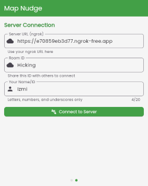

# MapNudge
Map Nudge is a real-time location sharing solution built with Node.js and Socket.IO. It also provides seamless route visualization between shared locations by integrating the Google Maps Directions API.

## Previews

